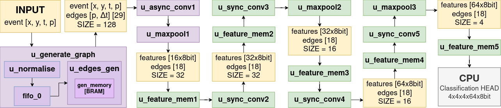

# This is the Hardware Part of the Project

This directory contains the files necessary to generate bitstream for the MNIST-DVS classification system. 

## System overview

The graph generation and feature extraction hardware module enables pipelined processing of event data. For this demonstration the hardware module is implemented for "multiple sequences" mode (to enable classification on multiple event files). For MNIST-DVS dataset, due to it's low dynamics, the classification is calculated based on the 200 ms data samples. However, the hardware module was also evaluated on the N-Cars dataset with 100 ms "time windows". The achieved latency and throughput are similar for both datasets.

In this diagram, the asynchronous part (event-by-event processing) is highlighted with purple blocks. The green blocks indicate synchronous part (channel-by-channel processing). Yellow blocks are used to represent data shared between selected hardware modules. 

## `HW` directory overview

- `src_feature_extractor` - source code for graph generation and feature extraction hardware module
- `src_ps_pl_communication` - source code for PS-PL communication
- `mem` - BRAM memory initialisation files (GCNN weights for synchronous convolutions)
- `img` - images for README
- `build_project.tcl` - a TCL script for Vivado 2022.2 project generation

## Open design and generate bitstream manual

1. Clone this repository.
2. Navigate to `repository/HW/src_feature_extractor`, open `mnist_pkg.sv` file and set correct `REPO_PATH` parameter (top repository directory). The code presented was implemented on the Ubuntu 22.04 operating system. If you are using Windows, you will need to make an additional edit to `MEMORY_DIR_PATH` parameter in line 53 of the `top.sv` file (due to the use of backslash instead of fraction slash).
2. Open Vivado 2022.2 (module tested exclusively for this version).
3. Navigate to `repository/HW/` directory in Vivado `TCL console`.
4. Run `source build_project.tcl` to create Vivado project with our hardware module.
5. Now you can study our hardware module, run synthesys, implementation and bitstream generation.
6. If you want to run demo with your own XSA file, use File->Export->Export Hardware (remember to check `Include bitstream` option)

## Hardware modules description (`src_feature_extractor`)

### `./mnist_pkg.sv` module

Package containing the most important parameters and data types used for MNIST-DVS classification system

### `./top_synth.v` module

Top module for synthesis and implementation (included in project's Block Design)

### `./top.sv` module

Top module containing all used hardware modules of the system for graph generation and feature extraction

### `./generate_graph.sv` module

Top module for graph representation generation.

### `./normalize.sv` module

Scale and normalize event's x, y and t values before graph generation.

### `./edges_gen.sv` module

Generate edges based on context memory (inside this module we use `fifo_generator_0` FIFO as event's buffer). For each incoming event we search it's context, i.e. last recored events for neighbouring x and y coordinates. Events (vertices) that met the neighbourhood contition are connected with edges. For this purpose we need 15 clock cycles (15 reads on one memory port and 14 reads and one write for the other) which constitues the throughput bottleneck of the system. 

### `./memory.sv` module

Paramterizable module implementing dual-port RAM memory realized for UltraRAM or BlockRAM, respectively (Based on AMD's Language Templates)

### `./delay_module.sv` and `./src/delay_single.sv` modules

Simple synchronous delay on data. 

### `./async_conv.sv` module

Asynchronous convolution for event-by-event processing (Linear layer + ReLU). For each incoming event and each of it's edges, the matrix multiplication is applied. For the maximum of 29 edges and one "self-loop" two multiplixation modules are used for 15 sequential operations. The weights and biases stored in DRAM are included in module's input. 

### `./matrix_multiplication.sv` module

Matrix multiplitacion module (for 1D x 2D = 1D matrixes). This module performs both multiplication and quantization and has a latency of 2CC. 

### `./async_maxpool.sv` module

Relaxing MaxPool layer. For 4x4 MaxPool all events are accumulated for 200/32ms (temporal channel) and rescaled in x, y and time dimensions. Resulting feature vectors are created with element-wise max operation and represent 4x4x4 parts of graph. First MaxPool in network splits between asynchronous and synchronous parts of the system (due to disturbed order of events).

### `./feature_memory.sv` module

Memory used to store feature maps between consecutive layers. The three-memory switching mechanism enables efficient use of memory - when the previous layer in the model writes data to one of the memories, the next layer reads values from the others. In this way, each layer can perform calculations in parallel, as long as data is available at its input.

### `./sync_conv.sv` module

Synchronous convolution for channel-by-channel processing (Linear layer + ReLU). Due to relaxed throughput requirements (a consequence of using Relaxing MaxPool), the operation is performed with two vector multiplication modules for each element of the output feature map sequentially, which makes it possible to significantly reduce the necessary resources. Weights and biases stored internally with BlockRAM. 

### `./memory_weights.sv` module

Parametrizable module implementing single-port ROM memory realized for UltraRAM or BlockRAM, respectively (Based on AMD's Language Templates).

### `./vector_multiplication.sv` module

Vector multiplitacion module. This module performs both multiplication and quantization and has a latency of 3CC.

### `./sync_maxpool.sv` module

Synchronous MaxPool layer (for channel-by-channel processing). The module is used to further scale the graph in x, y and time dimensions. Each successive MaxPool further relaxes the following modules throughput requirements. 

### `./out_serialize.sv` module

Output feature map serialization for PS-PL communication.

## Hardware modules description (`src_ps_pl_communication`)

Some simple modules are added to assist PS-PL communitation for the purpose of this demonstration.
