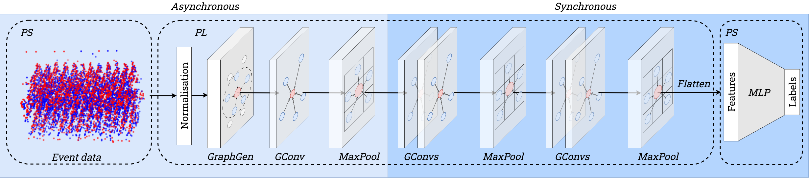

# Graph Convolutional Neural Networks for Event Based Vision for AMD SoC FPGA

This repository provides the first hardware module for acceleration of Graph Convolutional Neural Network for Event Data processing on SoC FPGA. The solution deployed for the Zynq UltraScale+ MPSoC ZCU104 platform was evaluated for objects classification for the MNIST-DVS and N-Cars datasets. The system is implemented using the SystemVerilog language and the Vitis/Vivado 2022.2 environment.

<div align="center">
  <br>
    <p style="font-size:1.5vw;">We present the hardware architecture as a pipeline of modules that process event data in a completely parallel manner. The system consists of two parts -- asynchronous (operating in an event-by-event manner) and synchronous, in which operations are performed on sub-graphs. </p>
</div>


## Authors

|Name|Role|Contact|Affilation|
|-|-|-|-|
|Kamil Jeziorek|PhD Student|kjeziorek@agh.edu.pl|AGH University of Krakow, Poland|
|Piotr Wzorek|PhD Student|pwzorek@agh.edu.pl|AGH University of Krakow, Poland|
|Krzysztof Błachut|PhD Student|kblachut@agh.edu.pl|AGH University of Krakow, Poland|
|Tomasz Kryjak|Supervisor|kryjak@agh.edu.pl|AGH University of Krakow, Poland|

## Additional Information

|Category|Description|
|-|-|
|Team number|AOHW-284|
|Board used|Zynq UltraScale+ MPSoC ZCU104 Evaluation Kit|
|Software version|Vivado 2022.2|
|Link to YouTube Video|[https://youtu.be/w8-i1E3F-jE](https://youtu.be/w8-i1E3F-jE)|

## Getting Started

The project is divided into two parts: Software and Hardware. For more information, please refer to the README files in the `SW`, `HW` and `demo` folders.

### Software

The software part of the project is responsible for evaluating models and preprocessing datasets that are used in Hardware part. The software part is located in the `SW` folder.

### Hardware

The hardware part of the project is responsible for implementing the Graph Convolutional Neural Network on the FPGA. The hardware part is located in the `HW` folder.

### Demo

The `demo` folder provides all files necessary for running the MNIST-DVS classification demo for GCNNs inference with Zynq UltraScale+ MPSoC ZCU104 Evaluation Kit.


## Citation
If you find this project useful in your research, please consider citing our work:

```BibTeX
@article{jeziorek2024embedded,
  title={Embedded Graph Convolutional Networks for Real-Time Event Data Processing on SoC FPGAs},
  author={Jeziorek, Kamil and Wzorek, Piotr and Blachut, Krzysztof and Pinna, Andrea and Kryjak, Tomasz},
  journal={arXiv preprint arXiv:2406.07318},
  year={2024}
}


@article{jeziorek2024optimising,
  title={Optimising Graph Representation for Hardware Implementation of Graph Convolutional Networks for Event-based Vision},
  author={Jeziorek, Kamil and Wzorek, Piotr and Blachut, Krzysztof and Pinna, Andrea and Kryjak, Tomasz},
  journal={arXiv preprint arXiv:2401.04988},
  year={2024}
}

@inproceedings{jeziorek2023memory,
  title={Memory-efficient graph convolutional networks for object classification and detection with event cameras},
  author={Jeziorek, Kamil and Pinna, Andrea and Kryjak, Tomasz},
  booktitle={2023 Signal Processing: Algorithms, Architectures, Arrangements, and Applications (SPA)},
  pages={160--165},
  year={2023},
  organization={IEEE}
}
```