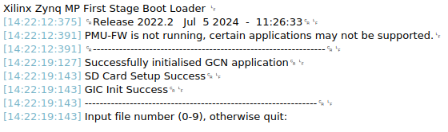

# This is the Hardware Demo

## Overview

This demo enables the use of the hardware accelerated Graph Convolutional Neural Network for event-based MNIST-DVS classification with Zynq UltraScale+ MPSoC ZCU104 Evaluation Kit. For this dataset, due to it's low dynamics the classification score is calculated based on the 200 ms samples of data. For this purpose submitted code was configured to work in "multiple sequences" mode - 200ms samples from dataset are processed independently (so the continous processing for longer sequences is disabled). For running the demo you'll need following tools and hardware:
- Zynq UltraScale+ MPSoC ZCU104 Evaluation Kit with power supply,
- MicroSD card,
- MicroUSB - USB Jtag cable,
- Vitis 2022.2 (and Vivado 2022.2 if you want to build your own bitstream).

## Setup

To set up the demo:
1. Clone this repository on Host PC.
2. Copy all files from `$REPO/demo/sd` directory to MicroSD Card, eject it and insert to ZCU104.
3. Connect ZCU104 to Host PC with MicroUSB - USB Jtag cable (you may need to install drivers).
4. Turn on ZCU104 with the On/OFF switch.
5. Open Vitis 2022.2. 
6. There are two ways of setting up this demo. You can use the exported project `$REPO/demo/vitis_export_archive.ide.zip` (just open Vitis and run File->Import) or build project from source files:
	- File -> New -> Platform Project -> enter name -> Next -> load `$REPO/demo/src/top_design_wrapper.xsa` file -> Finish[1](#myfootnote1)
	- In 'Explorer' tab find the `platform.spr` and click on it. For each of three Board Support Packages click `Modify BSP Settings` and make sure that `xilffs` library is enabled.
	- File -> New -> Application project -> Next -> choose created platform project -> Next -> enter name -> Next -> Next -> choose Empty Application (C++) -> Finish
	- Copy `.c`, `.h`, `.cpp` files from `$REPO/demo/src` into src folder of application project.
7. Build the platform project (right click -> Build Project).
8. Build the application project (right click -> Build Project).
7. Open the terminal (e.g. CuteCom, PuTTY, Vitis build-in terminal[2](#myfootnote2)) to access connected USB device with Serial Communication (e.g. `/dev/ttyUSB1`).
8. Launch the application (right click on the application project -> Run As -> 1 Launch Hardware)
9. After the bitstream programming, in terminal you should see the following:

<a name="myfootnote1">1</a>: Alternatively, you can generate your own XSA file after bitstream generation (see `$REPO/HW/README.md`). 

<a name="myfootnote2">2</a>: Window -> Show view -> Terminal -> Terminal -> Serial and then click on Open a Terminal -> set parameters Baud Rate 115200, Data Bits 8, Parity None, Stop Bits 1, Flow Control None and choose right Port.

## What's next?

There are 100 randomly selected samples from MNIST-DVS dataset on the MicroSD Card - 10 samples recorded with event camera for each of 10 digits. The demo application is waiting for user input of a single digit (corresponding to the digit visible in the sequence) and then for another digit (corresponding to the number of sample for this particular digit). When the input is entered, the PS will access the MicroSD card for network's head weights and event data, which is then passed to PL for feature extraction. In the terminal You should see 4 consecutive feature vectors being received by PS. Then, the PS uses network's head for obtaining final results and displays correct class, predicted class and processing time. You can run multiple inferences without reprogramming the device. To verify the contents of particular event data sample, you can use `$REPO/demo/visualize.py` script to visualize data in the form of pseudo frame (required matplotlib and numpy library). 

